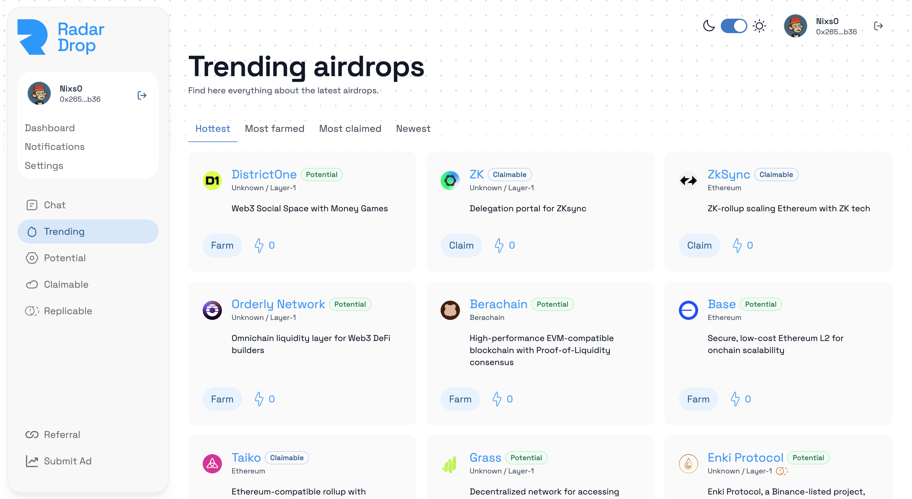

# Airdrop Finder

With our Airdrop Finder, get a complete list of ongoing trendy airdrops and keep up to date with all the upcoming/potential airdrops in the cryptocurrency space.

You'll also be able to see which airdrops are the most farmed and which have been the most claimed.

* Trending: In trending, you'll find all the latest airdrops that are trending in the crypto ecosystem.
* Potential: Airdrops with a "potential" badge are new projects rumored to airdrop.&#x20;
* Claimable: Airdrops categorized as claimable are those for which people can claim their tokens.
* Replicable: Enfin, les airdrops réplicables sont ceux que les utilisateurs peuvent répliquer en utilisant notre ultimate feature: [Replication](replication.md).

<figure><figcaption></figcaption></figure>

You'll also be able to classify airdrops according to their novelty, whether they've been farmed a lot and which airdrops are the hottest.

<figure><figcaption>
Airdrop card on which we can see the badge Potential and the logo of the Replication 
</figcaption></figure>

