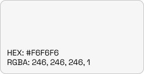

# Brand Kit

These materials are the official branding resources for RadarDrop, RadarDrop AI, and $RDAI.

Here's our [brandbook](https://res.cloudinary.com/dkensloln/image/upload/v1718978969/static/euvpm6ktzhgamez3sugl.pdf).

## Logos and Icons

### RadarDrop

<figure><figcaption>
RadarDrop default logo
</figcaption></figure>

<figure><figcaption>
RadarDrop variant logotype
</figcaption></figure>

<figure><figcaption>
RadarDrop vertical logotype
</figcaption></figure>

<figure><figcaption>
RadarDrop horizontal logotype
</figcaption></figure>

## Font and color

### Font

<figure><figcaption></figcaption></figure>

### Colors

<figure><figcaption></figcaption></figure>

<figure><figcaption></figcaption></figure>

<figure><figcaption></figcaption></figure>

<figure><figcaption></figcaption></figure>

<figure><figcaption></figcaption></figure>

<figure><figcaption></figcaption></figure>

